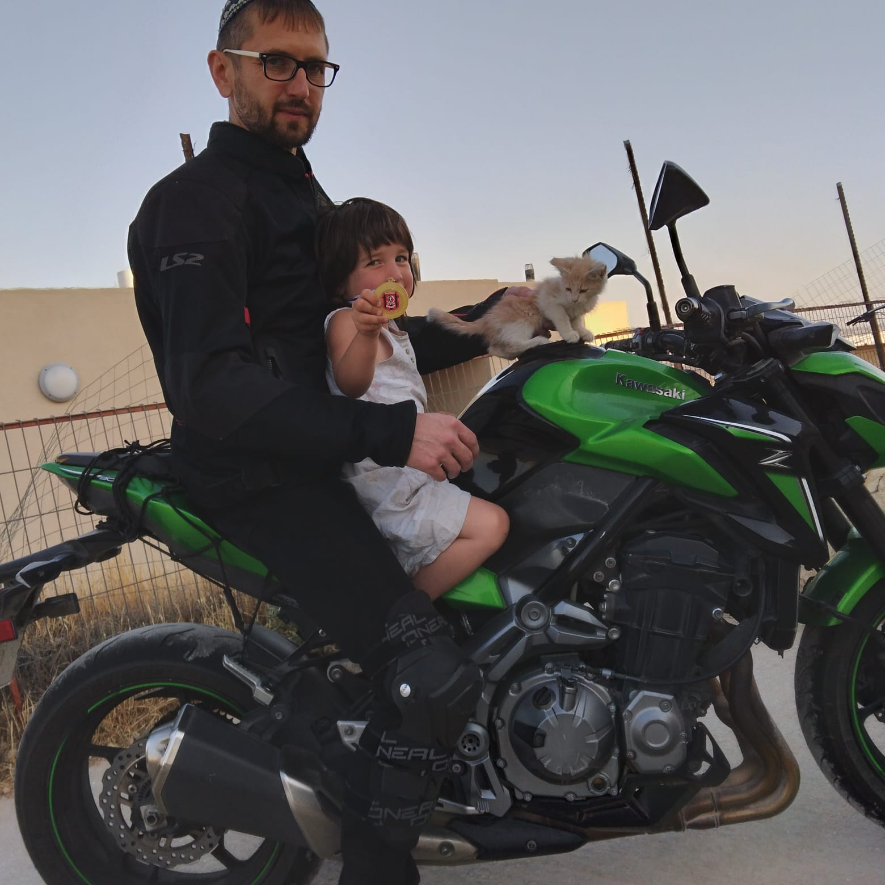

<h1 align="center">Hi 👋, I’m Moshe Vilner</h1>

  
  

<h3 align="center">## I Like Front End technologies.</h3>  
<h3 align="center">Also, i like bikes!</h3> 

## 🚀 Skills

  
  
  

## 📫 Get in Touch

- [LinkedIn](https://www.linkedin.com/in/moshe-vilner-7a7745a/)
- [Website](https://shootermv.github.io/moshe-vilner/)
- Email: <shootermv@gmail.com>

## 🔧 Tools & Technologies

  
  
  
  

